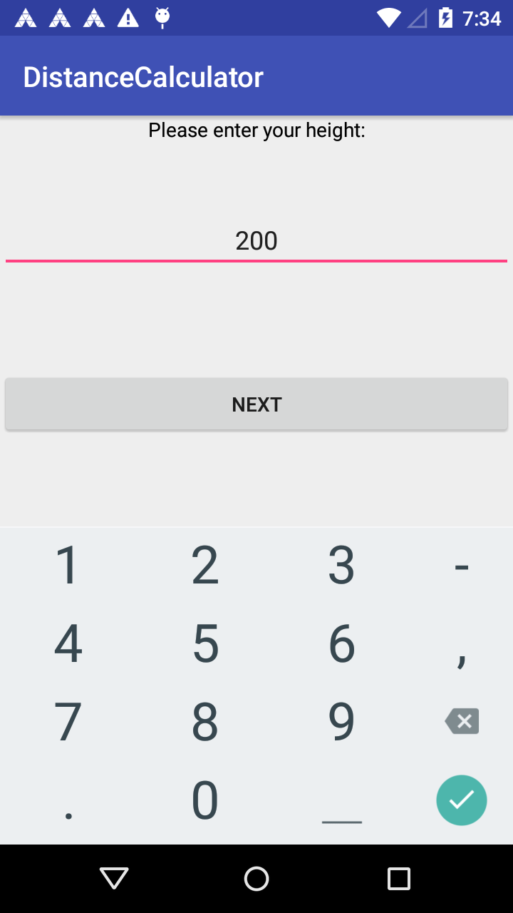
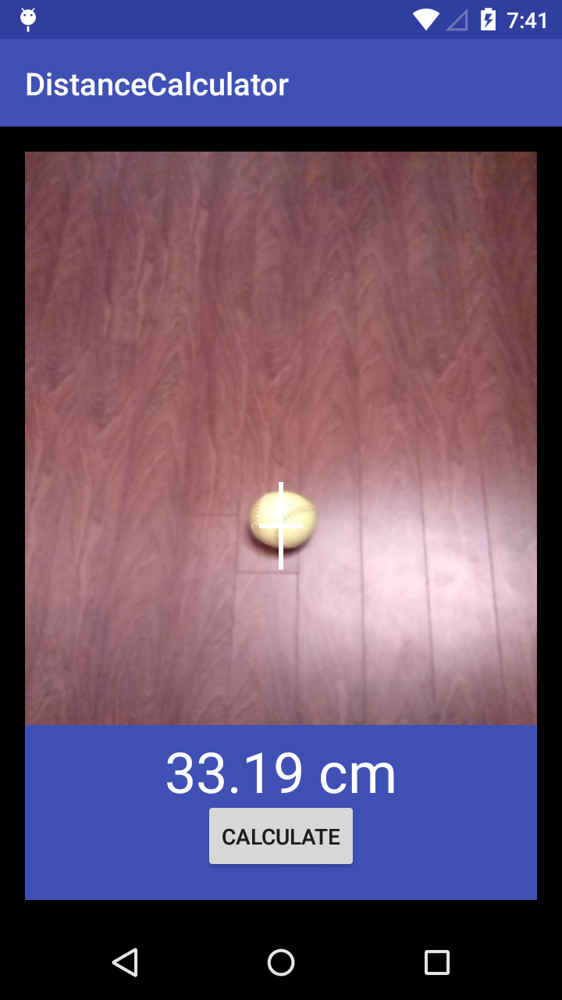

# DistanceCalculator

A mobile app where it calculates the distanceCalculator by analyzing a photo.

Screenshots
-------------

 

Pre-requisites
--------------

- Android SDK 25 or older.

Introduction
------------
CameraActivity.java class was followed by this [tutorial][8]
This app mainly uses the following APIs:
- [Camera2 API][1]
- [getCameraIdList][2]
- [CameraDevice.StateCallback][4]
- [CameraCaptureSession][5]
- [CaptureRequest][6]
- [capture][7]

This app is tested on SDK 25.

[1]: https://developer.android.com/reference/android/hardware/camera2/package-summary.html
[2]: https://developer.android.com/reference/android/hardware/camera2/CameraManager.html#getCameraIdList()
[3]: https://developer.android.com/reference/android/hardware/camera2/CameraManager.html#getCameraCharacteristics(java.lang.String)
[4]: https://developer.android.com/reference/android/hardware/camera2/CameraDevice.StateCallback.html
[5]: https://developer.android.com/reference/android/hardware/camera2/CameraCaptureSession.html
[6]: https://developer.android.com/reference/android/hardware/camera2/CaptureRequest.html
[7]:https://developer.android.com/reference/android/hardware/camera2/CameraCaptureSession.html#capture
[8]: https://inducesmile.com/android/android-camera2-api-example-tutorial/

